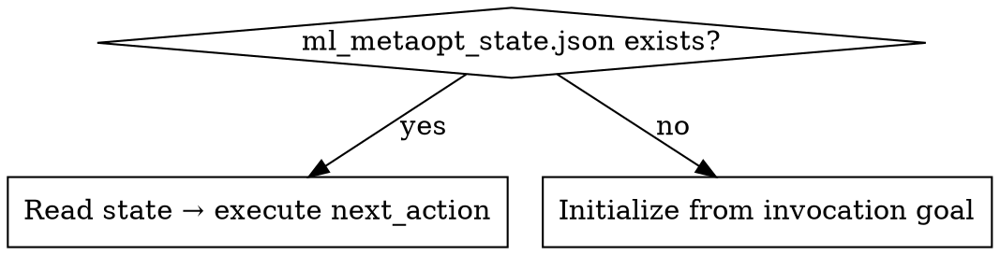
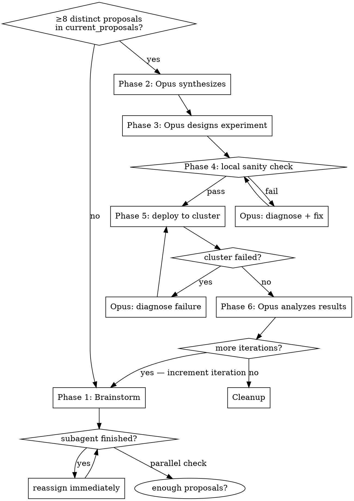

# ml-metaoptimization

## Overview

Two-layer autonomous loop: 8 parallel local brainstorming subagents run continuously while a Ray cluster executes the designed experiment. When the cluster finishes, the next experiment is already fully refined.

**The main agent is the orchestrator only.** It never does analytical or coding work directly — it delegates everything to subagents and manages state.

**Core rules:**
- **Always maintain exactly 8 active brainstorming subagents.** When any finishes, immediately dispatch a replacement before doing anything else. Check the count after every subagent completes.
- Synthesis, experiment design, monitoring, and analysis subagents run **on top** of the 8 — maximum 10 subagents total at any point.
- Never ask the user — dispatch an Opus 4.6 fast subagent for any decision
- Coding tasks → Opus 4.6 fast subagents only
- Never deploy to cluster without passing local sanity check (leakage + performance)
- Update state file after every phase transition — compaction safety
- **Subagent failure:** relaunch once. If rate-limited, wait then relaunch. If it fails again, abandon that task and record it in `key_learnings`.

## Prerequisites

- `jc1122/ray-hetzner` installed locally — provides full cluster infrastructure and deploy pattern
- Ray cluster running (see ray-hetzner docs)

## Folder Structure

```
{project_root}/
  ml_metaopt_state.json     # created on start, deleted on finish
  AGENTS.md                 # resume hook appended on start, removed on finish
```

## Session Start



## Initialization (first run only)

1. Write `ml_metaopt_state.json` (see State Schema below)
2. Create `AGENTS.md` at project root if it does not exist. Append the following block:

```
## Active task
ml_metaopt_state.json is present. Invoke the ml-metaoptimization skill immediately
and resume from saved state. Do not ask the user anything.
```

## The Meta-Iteration Loop



## Phase 1 — Continuous Brainstorming

Dispatch 8 subagents in parallel. Assign roles dynamically — all 8 can cover different ground.

**Model rules:**
- Coding tasks → Opus 4.6 fast only
- All other tasks → GPT-5.4 or Opus 4.6 fast

**Context to pass to every subagent:**
`goal`, `metric`, `baseline`, `key_learnings`, `completed_experiments`, `pending_proposals` from state file, plus any task-specific context (e.g. relevant code, data schema).

**Continuous operation:** When any subagent finishes, immediately assign it a new task on a different angle. Never let a subagent be idle.

**Role pool (assign dynamically based on what advances the goal most):**
feature engineering, HPO space design, leakage audit, code speedup/profiling, model architecture variants, target formulation variants, data quality analysis, ensemble design, and any other angle relevant to the current goal.

**Proposal threshold:** Brainstorm until `current_proposals` contains 8 distinct, non-overlapping proposals. If a subagent returns a duplicate or overlapping proposal, reassign it to a different angle immediately — it does not count. **Floor:** if all 8 subagents have each completed at least 2 rounds (16 total attempts) and fewer than 8 distinct proposals exist, proceed to synthesis with what is available. Fewer than 4 proposals is a red flag — record it in `key_learnings`.

Update `subagent_assignments` and `current_proposals` in state file as proposals arrive. New proposals generated during Phases 2–6 go into `next_proposals`, not `current_proposals`.

## Phase 2 — Synthesis (Opus subagent)

Dispatch one Opus 4.6 fast subagent with:
- All proposals collected so far from brainstorming subagents
- Full state context (`goal`, `metric`, `baseline`, `key_learnings`, `completed_experiments`)

It ranks proposals by expected impact and returns the single highest-leverage experiment to pursue.

## Phase 3 — Experiment Design (Opus subagent)

Dispatch one Opus 4.6 fast subagent with:
- Winning proposal from synthesis
- ray-hetzner README (read from local installation)
- Current `baseline` and `key_learnings`

It returns a complete Ray campaign specification: script design, search space, and deploy instructions.

## Phase 4 — Local Sanity Check

**Purpose:** verify configs are correct and infrastructure is wired up. This is not a performance or training run — all heavy computation is delegated to the Ray cluster, which must be kept saturated.

**Hard constraint: the check must complete in under 60 seconds.** Use the smallest possible subset: 1 dataset, 1–2 batches or iterations, no warmup, no evaluation loop. If the script does not support a fast-exit flag, dispatch an Opus 4.6 fast subagent to add one before running.

Checks:
1. **Config validity** — script loads, hyperparameters parse, no import or path errors
2. **Temporal leakage** — must pass with zero leakage

**If either fails:** dispatch Opus 4.6 fast subagent with the failure output. It diagnoses and returns a fix. Apply and re-run. Do not deploy until both checks pass.

Brainstorming subagents continue running throughout this phase.

## Phase 5 — Deploy to Ray Cluster

Use the deploy pattern from jc1122/ray-hetzner. Update `cluster_job` in state file immediately after launch.

**Do not stop brainstorming subagents** — they continue refining the next iteration while the cluster runs. Their proposals go into `next_proposals`.

**Cluster monitoring:** dispatch one Opus 4.6 fast subagent with the ray-hetzner README and cluster job details. It runs the ray-hetzner smoke tests once and reports back: running, completed, or failed. Dispatch again when a status check is needed — do not poll continuously.

**If cluster job fails:** dispatch Opus 4.6 fast subagent with:
- Full error log
- ray-hetzner README (read from local installation)

It diagnoses the failure and returns a fix. Apply and re-deploy.

## Phase 6 — Collect, Analyze, Update Baseline

Collect results from cluster. Dispatch Opus 4.6 fast subagent with results + current `baseline` to compare performance and extract learnings.

Update in state file: `baseline` (if improved), `key_learnings`, `completed_experiments`.

## Phase 7 — Iterate or Complete

- `current_iteration < total_iterations` → move `next_proposals` into `current_proposals`, clear `next_proposals`, increment `current_iteration`, set `current_phase = 1`, update `next_action` to `"start brainstorming phase"`, go to Phase 1
- Done → remove the resume hook from `AGENTS.md`, delete `ml_metaopt_state.json`

## State Schema

Write this file to `{project_root}/ml_metaopt_state.json`. Update after every phase transition.

```json
{
  "skill": "ml-metaoptimization",
  "resume_instruction": "Invoke the ml-metaoptimization skill and execute next_action immediately.",
  "goal": "<improvement objective stated at invocation>",
  "metric": "<primary evaluation metric>",
  "datasets": ["<dataset-id>"],
  "baseline": { "<dataset-id>": "<score>" },
  "total_iterations": "<N>",
  "current_iteration": "<i>",
  "current_phase": "<1-7>",
  "next_action": "<exact action to take on resume>",
  "subagent_assignments": [
    { "id": 1, "model": "opus|gpt", "task": "<description>", "status": "running|done" }
  ],
  "current_proposals": ["<proposal for current iteration — frozen at Phase 2 start>"],
  "next_proposals": ["<proposal accumulated during Phases 2–6 for next iteration>"],
  "completed_experiments": ["<experiment description>"],
  "key_learnings": ["<learning>"],
  "cluster_job": {
    "script": "<filename>",
    "started": "<ISO timestamp>",
    "status": "running|done|failed|none"
  }
}
```

## Common Mistakes

| Mistake | Fix |
|---------|-----|
| Orchestrator does analytical or coding work itself | Delegate to subagents — orchestrator manages state only |
| Active subagent count drops below 8 | Immediately dispatch a replacement before any other action |
| Asking the user a question | Dispatch Opus 4.6 fast subagent to decide instead |
| Coding task assigned to GPT subagent | Coding → Opus 4.6 fast only |
| Deploying to cluster before sanity check | Always complete Phase 4 first |
| Running a full training loop in Phase 4 | Sanity check must finish in <60s — use minimal batches/iterations only; heavy work goes to Ray |
| Ray cluster nodes sitting idle | Keep nodes saturated — deploy as soon as Phase 4 passes |
| Stopping subagents during cluster run | Keep all 8 running throughout the cluster job |
| Subagent sits idle after finishing | Reassign to a new angle immediately |
| Not passing state context to reassigned subagent | Always include relevant state fields per task |
| Not updating state file after phase transition | Compaction will lose current progress |
| Writing Phase 5 proposals into current_proposals | During cluster run, new proposals go into next_proposals only |
| Forgetting to swap next_proposals → current_proposals at iteration start | Phase 7: move queues before incrementing iteration |
| Counting duplicate/overlapping proposals toward the 8 | Reassign subagent to a new angle — duplicates don't count |
| Forgetting to clean up AGENTS.md on completion | Final step: remove hook + delete state file |
