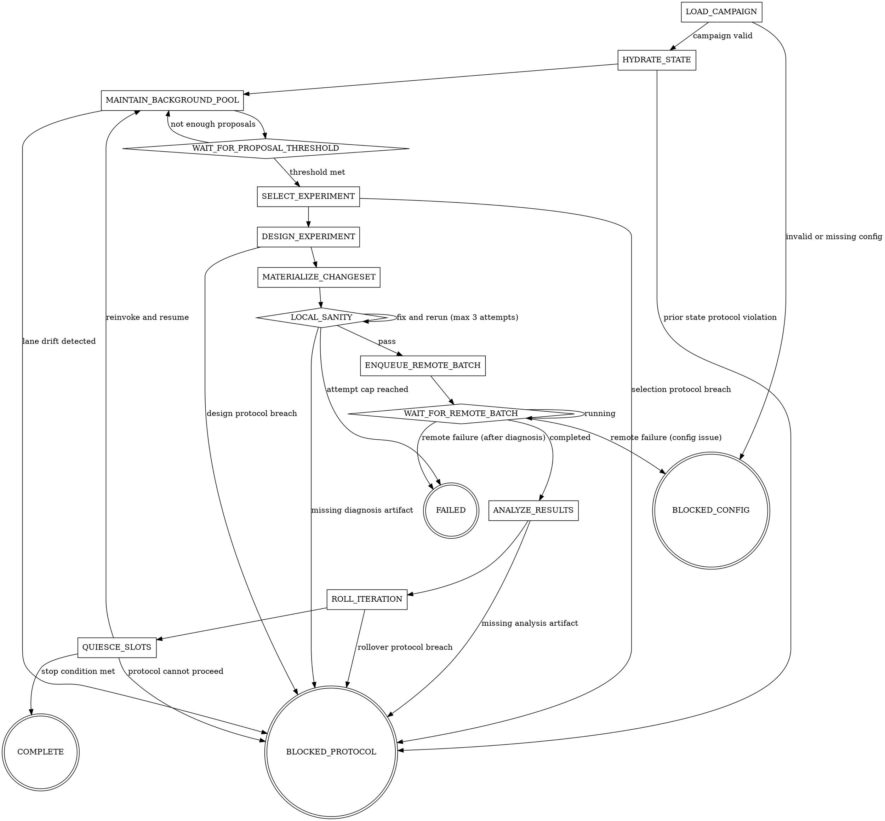

# ml-metaoptimization

## Overview

Run a continuous ML metaoptimization campaign as a deterministic state machine continuous across reinvocations.
This skill is not a self-scheduling daemon.
It persists state, exits, and resumes when a host runtime or user invocation re-enters it.

This skill is the control plane only. The orchestrator is a transport and runtime shell: it owns file I/O, process lifecycle, subagent dispatch, and state persistence, but delegates all semantic decisions to control agents. Control agents (documented in `references/control-protocol.md`) are the canonical semantic layer — they plan what work should happen, gate transition criteria, and emit structured handoffs that the orchestrator executes mechanically. The orchestrator never performs semantic coding, experiment design, debugging, or result analysis itself.

The campaign is fully file-driven. The orchestrator never asks the user for campaign-defining inputs. If required configuration is missing or invalid, the machine enters `BLOCKED_CONFIG` and stops. If persisted campaign identity no longer matches the campaign file, stop conservatively rather than silently resetting state.

## Runtime Contract

Target runtime: GitHub Copilot agent with subagent dispatch and access to multiple models.

Named models below refer to Copilot-exposed models. Model selection is deterministic, not discretionary:
- `strong_coder`: resolution order `claude-opus-4.6`, then `gpt-5.4`
- `strong_reasoner`: resolution order `claude-opus-4.6`, then `gpt-5.4`
- `general_worker`: resolution order `claude-sonnet-4`, then `gpt-5.4`

Within each family, prefer the highest available version: any opus ≥ 4.6 is preferred over `claude-opus-4.6`, and any gpt ≥ 5.4 is preferred over `gpt-5.4`, if exposed by the runtime. Record the requested model and resolved model in state metadata when the first choice is unavailable.

## Required Files

```
{project_root}/
  ml_metaopt_campaign.yaml
  AGENTS.md
  agents/
    worker-skills.json         # static runtime manifest; maps worker targets to probe paths for availability verification
  .ml-metaopt/
    preflight-readiness.json   # emitted by metaopt-preflight; required before LOAD_CAMPAIGN proceeds
    state.json
    artifacts/
      code/
      data/
      manifests/
      patches/
```

`.ml-metaopt/preflight-readiness.json` is the readiness artifact produced by `metaopt-preflight`.
`LOAD_CAMPAIGN` reads this artifact after campaign validation passes; if it is missing, stale (hash mismatch), or failed, the orchestrator transitions to `BLOCKED_CONFIG` with a directive to run or re-run `metaopt-preflight`.

Append this block to `AGENTS.md` on initialization if it is not already present:

```markdown
<!-- ml-metaoptimization:begin -->
## Active task
`.ml-metaopt/state.json` exists. Inspect its `status`.
If `status` is `RUNNING`, invoke the `ml-metaoptimization` skill immediately,
resume from `machine_state`, and do not ask the user for campaign inputs.
If `status` is terminal, remove this block, stop auto-resuming, and surface `next_action` to the operator without executing from it.
<!-- ml-metaoptimization:end -->
```

Remove only this marked block when entering `BLOCKED_CONFIG`, `BLOCKED_PROTOCOL`, `FAILED`, or `COMPLETE`.

If `AGENTS.md` does not exist on first run, create it before appending the marked block.

## Behavioral Guarantees

- never ask the user for campaign-defining inputs
- never let the orchestrator perform semantic coding directly
- the orchestrator must not edit project files directly; it may only apply worker-produced patches mechanically or write protocol-owned artifacts/manifests/state files
- generic semantic fallback is forbidden: if the orchestrator encounters unsupported semantic work, it must never improvise; instead it fails closed to `BLOCKED_PROTOCOL` with recovery guidance
- background slots are filled before auxiliary work is launched — `metaopt-background-control` enforces this through its `launch_requests`; the orchestrator must not fill slots autonomously outside of a control-agent handoff
- use the queue backend contract instead of raw cluster operations; the orchestrator never calls queue commands directly — it dispatches `@hetzner-delegation-worker` for `queue_op` executor directives emitted by `metaopt-remote-execution-control`, then writes the worker's JSON result to `.ml-metaopt/queue-results/` for the control agent to read
- use the aggregate metric as the authoritative campaign score
- bound `LOCAL_SANITY` remediation to at most three attempts per experiment
- never silently discard prior state on campaign identity drift
- drain or cancel active slots in `QUIESCE_SLOTS` before rollover or final cleanup
- re-invoke this skill only after `QUIESCE_SLOTS` has persisted outputs and torn down in-flight work
- verify required worker skill availability during `HYDRATE_STATE` before any dispatch
- `BLOCKED_PROTOCOL` preserves state and all artifacts, removes the `AGENTS.md` hook, and stops with a descriptive `next_action` for the operator
- `preferred_model` is a deterministic launch hint derived from the class resolution order; if the requested model is unavailable, the orchestrator must take the next configured fallback and record the substitution

## Dispatch Invariants

These are system-level constraints the orchestrator validates after applying each control-agent handoff. Slot management decisions — how many slots to fill, which mode to use, when to switch from ideation to maintenance — are made by `metaopt-background-control` and expressed in its `launch_requests`. The orchestrator enforces the following hard limits and rejects any handoff whose `launch_requests` would violate them (failing closed to `BLOCKED_PROTOCOL`):

- No more than `dispatch_policy.background_slots` active background slots during running states (except `QUIESCE_SLOTS`)
- No more than `dispatch_policy.auxiliary_slots` active auxiliary slots at a time
- Background slots may only run `ideation` or `maintenance`
- Auxiliary slots may only run `selection`, `design`, `materialization`, `diagnosis`, or `analysis`

**Subagent failure policy:**
- Relaunch once
- If the failure is rate-limit related, wait and relaunch once
- If the same task fails twice, record the failure in `key_learnings`, mark the task abandoned, and continue

## Required References

These files define the contract surface. Follow persisted state and canonical handoff output first; use these references to validate behavior, not to invent behavior from prose:

- `references/dependencies.md` before validating campaign inputs
- `references/contracts.md` before reading or writing state, manifests, or results
- `references/control-protocol.md` before applying control-agent handoffs
- `references/state-machine.md` before executing transitions or resuming from state
- `references/worker-lanes.md` before dispatching any background or auxiliary worker
- `references/dispatch-guide.md` before dispatching any background or auxiliary worker
- `references/backend-contract.md` before any remote queue action

Use `ml_metaopt_campaign.example.yaml` as the canonical campaign example rather than restating field-by-field examples inline.

## Orchestrator Actions

The orchestrator may:
- invoke the governing control agent for the current machine state as a subagent (see Control Agent Dispatch table below), read the resulting handoff from `.ml-metaopt/handoffs/`, and apply it mechanically per `references/control-protocol.md`
- read and validate campaign/state files
- update `.ml-metaopt/state.json`
- append/remove the marked `AGENTS.md` hook
- create and remove isolated worktrees
- run local sanity commands
- package immutable code/data artifacts
- write remote batch manifests
- dispatch `@hetzner-delegation-worker` for `queue_op` executor directives and write results to `.ml-metaopt/queue-results/`
- ingest machine-readable results
- emit iteration reports

The orchestrator must delegate all semantic decisions. Leaf workers are dispatched exclusively from `launch_requests` in control-agent handoffs — the orchestrator never constructs worker task files or prompt envelopes directly:
- proposal generation (via `metaopt-ideation-worker`)
- ranking and selecting proposals (via `metaopt-selection-worker`)
- experiment design (via `metaopt-design-worker`)
- semantic code changes (via `metaopt-materialization-worker`)
- debugging failing code or infra behavior (via `metaopt-diagnosis-worker`)
- result analysis (via `metaopt-analysis-worker`)
- iteration proposal filtering (via `metaopt-rollover-worker`)
- conflict resolution for non-trivial merges (via `metaopt-materialization-worker` in conflict-resolution mode)

## Control Agent Dispatch

Each machine state is governed by exactly one control agent. The orchestrator invokes the governing control agent as a subagent, reads the handoff it writes to `.ml-metaopt/handoffs/`, and applies it. See `references/control-protocol.md` for the full phase definitions and handoff envelope contract.

| Machine State(s) | Governing Control Agent | Modes |
|-----------------|------------------------|-------|
| `LOAD_CAMPAIGN` | `metaopt-load-campaign` | `validate` |
| `HYDRATE_STATE` | `metaopt-hydrate-state` | `hydrate` |
| `MAINTAIN_BACKGROUND_POOL`, `WAIT_FOR_PROPOSAL_THRESHOLD` | `metaopt-background-control` | `plan_background_work` → `gate_background_work` |
| `SELECT_EXPERIMENT`, `DESIGN_EXPERIMENT` | `metaopt-select-design` | `plan_select_experiment` → `gate_select_and_plan_design` → `finalize_select_design` |
| `MATERIALIZE_CHANGESET`, `LOCAL_SANITY` | `metaopt-local-execution-control` | `plan_local_changeset` → `gate_local_sanity` |
| `ENQUEUE_REMOTE_BATCH`, `WAIT_FOR_REMOTE_BATCH`, `ANALYZE_RESULTS` | `metaopt-remote-execution-control` | `plan_remote_batch` → `gate_remote_batch` → `analyze_remote_results` |
| `ROLL_ITERATION`, `QUIESCE_SLOTS` | `metaopt-iteration-close-control` | `plan_roll_iteration` → `gate_roll_iteration` → `quiesce_slots` |

## Quick Flow

Key running states introduced by the v3 contract:
- `DESIGN_EXPERIMENT` translates the winning proposal into an execution-ready experiment spec before code changes begin
- `QUIESCE_SLOTS` drains finished work, cancels leftovers, and prepares either rollover or final cleanup
- `MAINTAIN_BACKGROUND_POOL` keeps proposal-cycle bookkeeping continuous across reinvocations; the pool stays mutable there and freezes when `SELECT_EXPERIMENT` begins



Event priority (within each reinvocation):
1. Stage raw outputs of any completed slots before invoking the governing control agent
2. Invoke the governing control agent (plan or gate phase as appropriate) and apply the resulting handoff
3. During `QUIESCE_SLOTS`, execute only drain and cancel directives from the handoff — do not launch new workers

## Worker Policy

Background ideation workers generate and refine proposals.

`metaopt-background-control` dispatches background maintenance workers and must target `repo-audit-refactor-optimize` by default. The control agent bypasses that subskill only when the lane is explicitly incompatible with the repository or current task and falls back to findings-only maintenance, recording the incompatibility reason in the staged task file and the resulting state output.

Auxiliary workers handle:
- selection
- experiment design
- changeset materialization
- diagnosis
- result analysis

See `references/worker-lanes.md` for lane contracts, compatibility rules, and required subskill behavior.

## Worker Targets

Leaf workers are dispatched by the governing control agent via `launch_requests` in its handoff envelope. The orchestrator launches these workers from pre-staged task files written by the control agent — it does not construct worker task files or prompt envelopes directly.

| Lane | Skill | Model Class |
|------|-------|-------------|
| ideation | `metaopt-ideation-worker` | `general_worker` |
| selection | `metaopt-selection-worker` | `strong_reasoner` |
| design | `metaopt-design-worker` | `strong_reasoner` |
| materialization | `metaopt-materialization-worker` | `strong_coder` |
| diagnosis | `metaopt-diagnosis-worker` | `strong_reasoner` |
| analysis | `metaopt-analysis-worker` | `strong_reasoner` |
| rollover | `metaopt-rollover-worker` | `strong_reasoner` |
| maintenance | `repo-audit-refactor-optimize` | `general_worker` or `strong_coder` |

Each worker target has its own execution contract. The orchestrator consumes structured output from the result file path specified in the `launch_requests` entry.

Worker-target contracts reference `references/worker-lanes.md` and `references/contracts.md` in this repository as the authoritative source.

## Skill Availability

This section documents worker-target availability recorded during hydration.

`metaopt-hydrate-state` verifies required worker targets as part of its hydrate phase, before any dispatch occurs. The result is recorded in `state.runtime_capabilities` via `state_patch`:

```json
{
  "runtime_capabilities": {
    "verified_at": "<ISO 8601 timestamp>",
    "available_skills": ["metaopt-ideation-worker", "..."],
    "missing_skills": [],
    "degraded_lanes": []
  }
}
```

Compatibility note: the persisted state keys remain `available_skills` and `missing_skills`, even though they now track worker targets rather than only standalone skills.

### Required Worker Targets (block on missing)

These worker targets are required for the state machine to proceed past their dispatch points. If any is missing, transition to `BLOCKED_CONFIG` with `next_action = "install missing skill: <skill_name>"`.

- `metaopt-ideation-worker` — required for `MAINTAIN_BACKGROUND_POOL` ideation
- `metaopt-selection-worker` — required for `SELECT_EXPERIMENT`
- `metaopt-design-worker` — required for `DESIGN_EXPERIMENT`
- `metaopt-materialization-worker` — required for `MATERIALIZE_CHANGESET`
- `metaopt-diagnosis-worker` — required for `LOCAL_SANITY` and remote failure diagnosis handling
- `metaopt-analysis-worker` — required for `ANALYZE_RESULTS`

### Degradable Worker Targets (record and continue)

These worker targets have defined fallback behavior. If missing, record the degradation in `state.runtime_capabilities.degraded_lanes` and continue.

| Skill | Fallback Behavior |
|-------|-------------------|
| `metaopt-rollover-worker` | Carry over all `next_proposals` without filtering. Set `needs_fresh_ideation = false`. Record degradation in `key_learnings`. |
| `repo-audit-refactor-optimize` | Fall back to findings-only maintenance (already documented in Worker Policy). |

### Verification Timing

- `metaopt-hydrate-state` runs the full check once during its hydrate phase on session start
- If a previously-available worker target becomes unavailable mid-session, the dispatch will fail — treat as a subagent failure and apply the subagent failure policy
- Do not re-check on every dispatch; the `HYDRATE_STATE` snapshot is authoritative for the session

## Common Mistakes

| Mistake | Fix |
|---------|-----|
| Asking the user for campaign inputs | Read `ml_metaopt_campaign.yaml`; if invalid, transition to `BLOCKED_CONFIG` |
| Filling background slots without a control-agent handoff | Background slot launches must come from `metaopt-background-control` `launch_requests` — never fill slots autonomously |
| Treating all slots as ideation-only forever | `metaopt-background-control` switches slots to maintenance when proposal pools saturate; the orchestrator executes its `launch_requests` |
| Writing new ideas into `current_proposals` after selection starts | Write them into `next_proposals` only |
| Skipping `DESIGN_EXPERIMENT` and jumping straight into coding | Design the experiment batch before materialization starts |
| Allowing `LOCAL_SANITY` to spin forever | Cap remediation at 3 attempts, then transition to `FAILED` |
| Running raw cluster commands from this skill | Use only the queue commands declared by the backend contract |
| Improvising around unsupported semantic work | Fail closed to `BLOCKED_PROTOCOL` instead of inventing ad-hoc behavior |
| Using mutable working tree state as the remote execution source | Package immutable artifacts and enqueue a manifest |
| Comparing multi-dataset results without aggregation rules | Use `objective.aggregation` and `baseline.aggregate` |
| Re-invoking while workers are still running | Drain or cancel them in `QUIESCE_SLOTS` first |
| Declaring success without updating state | Persist state after every event that changes control flow |
