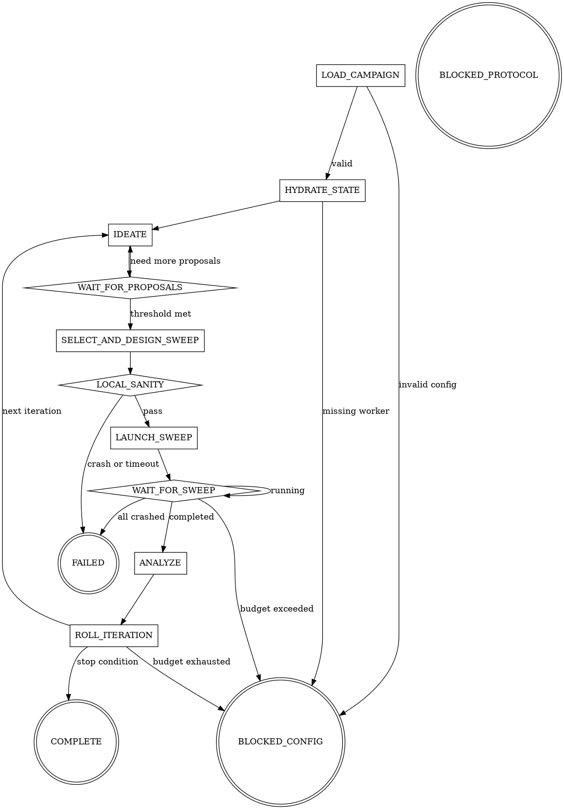

# ml-metaoptimization

## Overview

Run a continuous ML metaoptimization campaign as a deterministic state machine across reinvocations. Each iteration: agents propose a WandB sweep search space, the sweep runs on Vast.ai via SkyPilot with parallel agents, results are analyzed against a direction-aware baseline, and learnings carry forward to the next iteration. The campaign is fully file-driven via `ml_metaopt_campaign.yaml`.

This skill does NOT produce code patches, architecture changes, or algorithm optimizations. Those belong to the `code-optimization` skill (built on `repo-audit-refactor-optimize`). This skill exclusively sweeps hyperparameters, architectures, and ML configuration against an existing codebase. Agents design search spaces; WandB searches them; SkyPilot provisions compute.

Project contract: the target project must have a training entrypoint that reads hyperparameters from `wandb.config` and logs metrics via `wandb.log(...)`. No other coupling. The skill is framework-agnostic at the interface level, though PyTorch Lightning projects satisfy this contract naturally.

The state machine is persistent across reinvocations via `.ml-metaopt/state.json`. This skill is not a self-scheduling daemon. It persists state, exits, and resumes when a host runtime or user invocation re-enters it.

## Runtime Contract

Target runtime: GitHub Copilot agent with subagent dispatch and access to multiple models.

Named models below refer to Copilot-exposed models. Model selection is deterministic, not discretionary:
- `strong_reasoner`: resolution order `claude-opus-4.6`, then `gpt-5.4`
- `general_worker`: resolution order `claude-sonnet-4`, then `gpt-5.4`

Within each family, prefer the highest available version: any opus >= 4.6 is preferred over `claude-opus-4.6`, and any gpt >= 5.4 is preferred over `gpt-5.4`, if exposed by the runtime. Record the requested model and resolved model in state metadata when the first choice is unavailable.

No `strong_coder` class — v4 does not dispatch code-writing workers.

## Required Files

```
{project_root}/
  ml_metaopt_campaign.yaml
  AGENTS.md
  .ml-metaopt/
    preflight-readiness.json
    state.json
    handoffs/
    worker-results/
    tasks/
    final_report.md          (written on COMPLETE)
```

`.ml-metaopt/preflight-readiness.json` is the readiness artifact produced by `metaopt-preflight`. `LOAD_CAMPAIGN` reads this artifact after campaign validation passes; if it is missing, stale (hash mismatch), or failed, `metaopt-load-campaign` recommends `BLOCKED_CONFIG` with `next_action` set to run or re-run `metaopt-preflight`.

`metaopt-hydrate-state` manages the `AGENTS.md` resume hook. On initialization it creates `AGENTS.md` if absent and appends the marked block. On terminal states, the governing control agent emits a `remove_agents_hook` directive and the orchestrator executes it.

## Behavioral Guarantees

1. **Never ask the user for campaign-defining inputs.** Read `ml_metaopt_campaign.yaml`; if invalid, transition to `BLOCKED_CONFIG`.
2. **Orchestrator never calls WandB API or SkyPilot CLI directly.** All remote execution goes through `skypilot-wandb-worker` via directives only.
3. **`LOCAL_SANITY` enforces a 60-second hard timeout** — not configurable. If the smoke test has not crashed within 60 seconds, it passes. Failure means `FAILED` immediately, no remediation loop.
4. **`max_budget_usd` is always enforced.** Default is 10 USD. Budget is checked on every `poll_sweep` call. If exceeded, terminate all jobs and transition to `BLOCKED_CONFIG`.
5. **On crash recovery, reconnect to existing sweep.** Never launch a new sweep if `current_sweep.sweep_id` exists in state. `HYDRATE_STATE` detects this and reconnects.

## Control Agent Dispatch

Each machine state is governed by exactly one control agent. The orchestrator invokes the governing control agent as a subagent, reads the handoff it writes to `.ml-metaopt/handoffs/`, and applies it. See `references/control-protocol.md` for the full protocol.

| Machine State(s) | Governing Control Agent | Phase(s) |
|-----------------|------------------------|----------|
| `LOAD_CAMPAIGN` | `metaopt-load-campaign` | `validate` |
| `HYDRATE_STATE` | `metaopt-hydrate-state` | `hydrate` |
| `IDEATE`, `WAIT_FOR_PROPOSALS` | `metaopt-background-control` | `plan_ideation`, `gate_ideation` |
| `SELECT_AND_DESIGN_SWEEP` | `metaopt-select-design` | `plan_select_design`, `finalize_select_design` |
| `LOCAL_SANITY` | `metaopt-remote-execution-control` | `gate_local_sanity` |
| `LAUNCH_SWEEP` | `metaopt-remote-execution-control` | `plan_launch` |
| `WAIT_FOR_SWEEP` | `metaopt-remote-execution-control` | `poll` |
| `ANALYZE` | `metaopt-remote-execution-control` | `analyze` |
| `ROLL_ITERATION` | `metaopt-iteration-close-control` | `roll` |

## Quick Flow



## Worker Policy

Three worker types:

**Background ideation workers** (`metaopt-ideation-worker`): Propose WandB sweep search spaces. Each proposal includes a sweep config with parameter distributions and search method. Dispatched during `IDEATE` by `metaopt-background-control` via `launch_requests`.

**Analysis workers** (`metaopt-analysis-worker`): Read WandB best run results, compare against baseline using direction-aware comparison, update baseline if improved, extract learnings. Dispatched during `ANALYZE` by `metaopt-remote-execution-control` via `launch_requests`.

**Execution worker** (`skypilot-wandb-worker`): Directive-dispatched only — not a slot-based worker. Creates WandB sweeps, launches SkyPilot agents on Vast.ai, polls sweep status, enforces watchdog and budget. See `references/backend-contract.md`.

## Worker Targets

| Lane | Worker | Model Class |
|------|--------|-------------|
| ideation | `metaopt-ideation-worker` | `general_worker` |
| analysis | `metaopt-analysis-worker` | `strong_reasoner` |
| execution (directive) | `skypilot-wandb-worker` | `general_worker` |

## Required References

These files define the contract surface. Follow persisted state and canonical handoff output first; use these references to validate behavior, not to invent behavior from prose:

- `references/dependencies.md` before validating campaign inputs
- `references/contracts.md` before reading or writing state or results
- `references/control-protocol.md` before applying control-agent handoffs
- `references/state-machine.md` before executing transitions or resuming from state
- `references/worker-lanes.md` before dispatching any worker
- `references/dispatch-guide.md` before dispatching any worker
- `references/backend-contract.md` before any remote execution action

Use `ml_metaopt_campaign.example.yaml` as the canonical campaign example.

## Orchestrator Actions

The orchestrator may:
- Invoke the governing control agent for the current machine state as a subagent, read the resulting handoff, and apply it per `references/control-protocol.md`
- Read campaign and state files for protocol validation only
- Apply control-agent `state_patch` updates to `.ml-metaopt/state.json`
- Execute `run_smoke_test` directives by dispatching `skypilot-wandb-worker`
- Execute `launch_sweep` directives by dispatching `skypilot-wandb-worker`
- Execute `poll_sweep` directives by dispatching `skypilot-wandb-worker`
- Execute `remove_agents_hook` directives (remove marked block from `AGENTS.md`)
- Execute `delete_state_file` directives (delete `.ml-metaopt/state.json`)
- Execute `emit_final_report` directives (write `.ml-metaopt/final_report.md`)
- Execute `emit_iteration_report` directives (write iteration summary)

The orchestrator must delegate all semantic decisions to control agents and workers.

## Common Mistakes

| Mistake | Fix |
|---------|-----|
| Calling WandB API or SkyPilot CLI from the orchestrator | Use `skypilot-wandb-worker` via directive only |
| Launching a new sweep when `current_sweep.sweep_id` exists in state | Reconnect to the existing sweep in `HYDRATE_STATE` |
| Letting `LOCAL_SANITY` run longer than 60 seconds | The 60-second timeout is hardcoded — terminate the process |
| Exceeding `max_budget_usd` without stopping | Budget is checked on every `poll_sweep` — stop all jobs and `BLOCKED_CONFIG` |
| Asking user for sweep parameters | Read proposals from `current_proposals` — if empty, stay in `IDEATE` |
