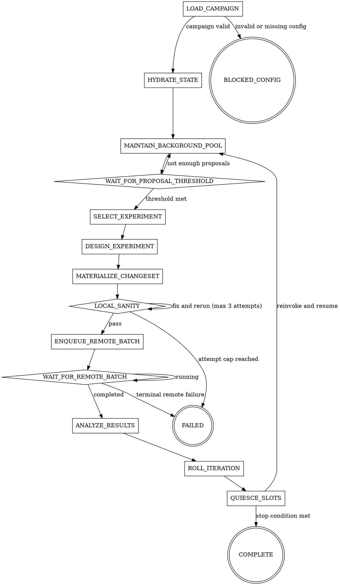

# ml-metaoptimization

## Overview

Run a continuous ML metaoptimization campaign as a deterministic state machine continuous across reinvocations.
This skill is not a self-scheduling daemon.
It persists state, exits, and resumes when a host runtime or user invocation re-enters it.

This skill is the control plane only. The orchestrator owns validation, persistence, slot scheduling, artifact packaging, queue interaction, and iteration transitions. It never performs semantic coding, experiment design, debugging, or result analysis itself.

The campaign is fully file-driven. The orchestrator never asks the user for campaign-defining inputs. If required configuration is missing or invalid, the machine enters `BLOCKED_CONFIG` and stops. If persisted campaign identity no longer matches the campaign file, stop conservatively rather than silently resetting state.

## Runtime Contract

Target runtime: GitHub Copilot agent with subagent dispatch and access to multiple models.

Named models below refer to Copilot-exposed models.
The specific model names are examples — use the strongest available model in the same class if a listed name is unavailable or superseded:
- `strong_coder`: prefer a strong coding model (e.g. `Opus 4.6 fast`); use for code changes, debugging, and conflict resolution
- `strong_reasoner`: prefer a strong reasoning model (e.g. `Opus 4.6 fast`), fallback to a capable general model (e.g. `GPT-5.4`); use for synthesis, experiment design, diagnosis, and analysis
- `general_worker`: prefer a capable general model (e.g. `GPT-5.4`), fallback to any stronger available model; use for ideation and read-only maintenance work

Always use the strongest available model in the same class and record the substitution in state.

## Required Files

```
{project_root}/
  ml_metaopt_campaign.yaml
  AGENTS.md
  .ml-metaopt/
    state.json
    artifacts/
      code/
      data/
      manifests/
      patches/
```

Append this block to `AGENTS.md` on initialization if it is not already present:

```markdown
<!-- ml-metaoptimization:begin -->
## Active task
`.ml-metaopt/state.json` exists. Inspect its `status`.
If `status` is `RUNNING`, invoke the `ml-metaoptimization` skill immediately,
resume from `machine_state`, and do not ask the user for campaign inputs.
If `status` is terminal, remove this block and follow `next_action` instead of auto-resuming.
<!-- ml-metaoptimization:end -->
```

Remove only this marked block when entering `BLOCKED_CONFIG`, `FAILED`, or `COMPLETE`.

If `AGENTS.md` does not exist on first run, create it before appending the marked block.

## Behavioral Guarantees

- never ask the user for campaign-defining inputs
- never let the orchestrator perform semantic coding directly
- refill an empty background slot before launching lower-priority work
- use the queue backend contract instead of raw cluster operations
- use the aggregate metric as the authoritative campaign score
- bound `LOCAL_SANITY` remediation to at most three attempts per experiment
- never silently discard prior state on campaign identity drift
- drain or cancel active slots in `QUIESCE_SLOTS` before rollover or final cleanup
- re-invoke this skill only after `QUIESCE_SLOTS` has persisted outputs and torn down in-flight work

## Dispatch Invariants

- Maintain exactly `dispatch_policy.background_slots` active background slots during all running states except `QUIESCE_SLOTS`
- Allow at most `dispatch_policy.auxiliary_slots` auxiliary slots at a time
- Background slots may run either `ideation` or `maintenance`
- Auxiliary slots may run `synthesis`, `design`, `materialization`, `diagnosis`, or `analysis`
- When `next_proposals` reaches `proposal_policy.next_cap`, background slots switch to maintenance-only mode until the next iteration begins
- If default maintenance is incompatible, fall back to findings-only maintenance and record the reason in state

**Subagent failure policy:**
- Relaunch once
- If the failure is rate-limit related, wait and relaunch once
- If the same task fails twice, record the failure in `key_learnings`, mark the task abandoned, and continue

## Required References

Load these files during execution:

- `references/dependencies.md` before validating campaign inputs
- `references/contracts.md` before reading or writing state, manifests, or results
- `references/state-machine.md` before executing transitions or resuming from state
- `references/worker-lanes.md` before dispatching any background or auxiliary worker
- `references/backend-contract.md` before any remote queue action

Use `ml_metaopt_campaign.example.yaml` as the canonical campaign example rather than restating field-by-field examples inline.

## Orchestrator Actions

The orchestrator may:
- read and validate campaign/state files
- update `.ml-metaopt/state.json`
- append/remove the marked `AGENTS.md` hook
- create and remove isolated worktrees
- run local sanity commands
- package immutable code/data artifacts
- write remote batch manifests
- call the queue backend commands declared in the campaign file
- ingest machine-readable results
- emit iteration reports

The orchestrator must delegate:
- semantic code changes
- experiment design
- ranking or synthesizing proposals
- debugging failing code or infra behavior
- result analysis
- conflict resolution for non-trivial merges

## Quick Flow

Key running states introduced by the v3 contract:
- `DESIGN_EXPERIMENT` translates the winning proposal into an execution-ready experiment spec before code changes begin
- `QUIESCE_SLOTS` drains finished work, cancels leftovers, and prepares either rollover or final cleanup
- `MAINTAIN_BACKGROUND_POOL` keeps proposal-cycle bookkeeping continuous across reinvocations and freezes the current pool when selection begins



Event priority:
1. Persist completed slot output
2. Refill an empty background slot
3. Process remote batch status changes
4. Evaluate transition guards
5. During `QUIESCE_SLOTS`, stop launching new work and only harvest, drain, or cancel active slots

## Worker Policy

Background ideation workers generate and refine proposals.

Background maintenance workers must invoke `repo-audit-refactor-optimize` by default. Only bypass that subskill when the lane is explicitly incompatible with the repository or current task. In that case, fall back to findings-only maintenance and record the incompatibility reason in `key_learnings` or task output.

Auxiliary workers handle:
- synthesis
- experiment design
- changeset materialization
- diagnosis
- result analysis

See `references/worker-lanes.md` for lane contracts, compatibility rules, and required subskill behavior.

## Common Mistakes

| Mistake | Fix |
|---------|-----|
| Asking the user for campaign inputs | Read `ml_metaopt_campaign.yaml`; if invalid, transition to `BLOCKED_CONFIG` |
| Letting a background slot sit empty | Refill it before launching lower-priority work |
| Treating all 8 slots as ideation-only forever | Background slots may switch to maintenance as proposal pools saturate |
| Writing new ideas into `current_proposals` after selection starts | Write them into `next_proposals` only |
| Skipping `DESIGN_EXPERIMENT` and jumping straight into coding | Design the experiment batch before materialization starts |
| Allowing `LOCAL_SANITY` to spin forever | Cap remediation at 3 attempts, then transition to `FAILED` |
| Running raw cluster commands from this skill | Use only the queue commands declared by the backend contract |
| Using mutable working tree state as the remote execution source | Package immutable artifacts and enqueue a manifest |
| Comparing multi-dataset results without aggregation rules | Use `objective.aggregation` and `baseline.aggregate` |
| Re-invoking while workers are still running | Drain or cancel them in `QUIESCE_SLOTS` first |
| Declaring success without updating state | Persist state after every event that changes control flow |
