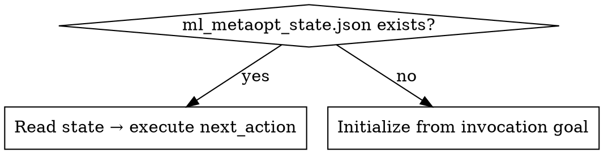
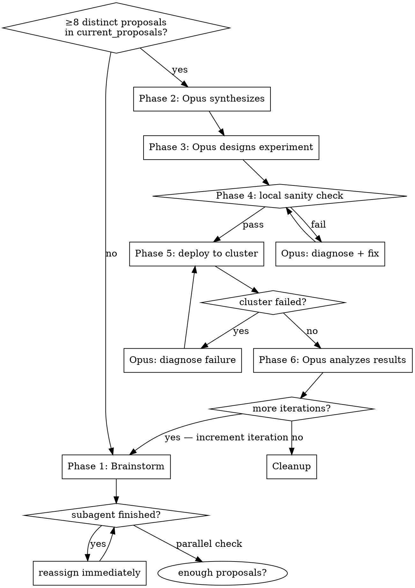

# ml-metaoptimization

## Overview

Two-layer autonomous loop: 8 parallel local brainstorming subagents run continuously while the Ray cluster runs **multiple parallel jobs that saturate all available nodes**. When the cluster finishes, the next experiment is already fully refined.

**Resource utilization is a first-class goal.** Every cluster deployment must fill all available workers. A single job that uses one node while others sit idle is a failure mode.

**The main agent is the orchestrator only.** It never does analytical or coding work directly — it delegates everything to subagents and manages state.

**Core rules:**
- **Always maintain exactly 8 active brainstorming subagents.** When any finishes, immediately dispatch a replacement before doing anything else. Check the count after every subagent completes.
- Synthesis, experiment design, monitoring, and analysis subagents run **on top** of the 8 — maximum 10 subagents total at any point.
- Never ask the user — dispatch an Opus 4.6 fast subagent for any decision
- Coding tasks → Opus 4.6 fast subagents only
- Never deploy to cluster without passing local sanity check (leakage + performance)
- Update state file after every phase transition — compaction safety
- **Subagent failure:** relaunch once. If rate-limited, wait then relaunch. If it fails again, abandon that task and record it in `key_learnings`.

## Prerequisites

- `jc1122/ray-hetzner` installed locally at a known path (e.g. `~/projects/ray-hetzner`)
- Ray cluster running — see bootstrap instructions in the Ray Cluster Reference below
- `config.env` present and populated (copy from `config.env.example`)

## Folder Structure

```
{project_root}/
  ml_metaopt_state.json     # created on start, deleted on finish
  AGENTS.md                 # resume hook appended on start, removed on finish
```

## Session Start



## Initialization (first run only)

1. Write `ml_metaopt_state.json` (see State Schema below)
2. Create `AGENTS.md` at project root if it does not exist. Append the following block:

```
## Active task
ml_metaopt_state.json is present. Invoke the ml-metaoptimization skill immediately
and resume from saved state. Do not ask the user anything.
```

## The Meta-Iteration Loop



## Phase 1 — Continuous Brainstorming

Dispatch 8 subagents in parallel. Assign roles dynamically — all 8 can cover different ground.

**Model rules:**
- Coding tasks → Opus 4.6 fast only
- All other tasks → GPT-5.4 or Opus 4.6 fast

**Context to pass to every subagent:**
`goal`, `metric`, `baseline`, `key_learnings`, `completed_experiments`, `pending_proposals` from state file, plus any task-specific context (e.g. relevant code, data schema).

**Continuous operation:** When any subagent finishes, immediately assign it a new task on a different angle. Never let a subagent be idle.

**Role pool (assign dynamically based on what advances the goal most):**
feature engineering, HPO space design, leakage audit, code speedup/profiling, model architecture variants, target formulation variants, data quality analysis, ensemble design, **code review** (bugs, silent errors, incorrect assumptions in supporting code), **leakage audit in code** (data leakage introduced by preprocessing or feature construction logic, not just config), **infrastructure code review** (inefficiencies in data loading, batching, or result serialization that waste cluster CPU/memory), and any other angle relevant to the current goal.

**Proposal threshold:** Brainstorm until `current_proposals` contains 8 distinct, non-overlapping proposals. If a subagent returns a duplicate or overlapping proposal, reassign it to a different angle immediately — it does not count. **Floor:** if all 8 subagents have each completed at least 2 rounds (16 total attempts) and fewer than 8 distinct proposals exist, proceed to synthesis with what is available. Fewer than 4 proposals is a red flag — record it in `key_learnings`.

Update `subagent_assignments` and `current_proposals` in state file as proposals arrive. New proposals generated during Phases 2–6 go into `next_proposals`, not `current_proposals`.

## Phase 2 — Synthesis (Opus subagent)

Dispatch one Opus 4.6 fast subagent with:
- All proposals collected so far from brainstorming subagents
- Full state context (`goal`, `metric`, `baseline`, `key_learnings`, `completed_experiments`)

It ranks proposals by expected impact and returns the single highest-leverage experiment to pursue.

## Phase 3 — Experiment Design (Opus subagent)

Dispatch one Opus 4.6 fast subagent with:
- Winning proposal from synthesis
- ray-hetzner README (read from local installation)
- Current `baseline` and `key_learnings`

It returns a complete Ray campaign specification: script design, search space, and deploy instructions.

**Utilization requirement:** the design must account for the number of available cluster workers and produce enough parallel trials/tasks to saturate all of them. Under-utilization (jobs that leave most workers idle) must be treated as a design flaw and sent back for revision before Phase 4.

## Phase 4 — Local Sanity Check

**Purpose:** verify configs are correct and infrastructure is wired up. This is not a performance or training run — all heavy computation is delegated to the Ray cluster, which must be kept saturated.

**Hard constraint: the check must complete in under 60 seconds.** Use the smallest possible subset: 1 dataset, 1–2 batches or iterations, no warmup, no evaluation loop. If the script does not support a fast-exit flag, dispatch an Opus 4.6 fast subagent to add one before running.

Checks:
1. **Config validity** — script loads, hyperparameters parse, no import or path errors
2. **Temporal leakage** — must pass with zero leakage

**If either fails:** dispatch Opus 4.6 fast subagent with the failure output. It diagnoses and returns a fix. Apply and re-run. Do not deploy until both checks pass.

Brainstorming subagents continue running throughout this phase.

## Phase 5 — Sync, Verify, and Deploy to Ray Cluster

### 5a — Sync code and data

Push all required project directories to the cluster. Every directory must be pushed to both the head and all workers (the head also executes tasks):

```bash
# First run of a campaign — include data (replace paths with actual project directories):
./push_code.sh ~/projects/ProjectA
./push_code.sh ~/projects/ProjectB

# Subsequent iterations — code changes only:
./push_code.sh --no-data ~/projects/ProjectB
```

`push_code.sh` uses `rsync --delete` and targets `/root/<project-name>` on every node by default. Warn if only the head was found (no workers joined yet).

### 5b — Verify cluster

Run both checks before deploying any jobs:

```bash
python connect_test.py      # confirms Ray client connectivity from laptop
python smoke_test.py        # submits one task per CPU, verifies work distributes across multiple nodes
```

`smoke_test.py` exits non-zero if all tasks ran on a single node — this means workers have not joined. Do not proceed until it passes.

**If smoke_test.py fails:** dispatch Opus 4.6 fast subagent with the failure output and the ray-hetzner OPERATIONS.md. It diagnoses and returns a fix (common causes: workers not joined, Ray not started on head, network issue).

### 5c — Deploy jobs

**Goal: saturate all available workers immediately.** Deploy multiple parallel jobs — one per distinct trial configuration or search space partition — so every node is busy from the start. Do not deploy a single sequential job.

Run long campaigns from the head inside tmux to survive laptop disconnects:

```bash
ssh root@$RAY_HEAD_IP
tmux new -s run
python /root/<project>/scripts/ray_runner.py   # replace with actual script path
```

For each job launched, append an entry to `cluster_jobs` in the state file immediately after launch.

**Do not stop brainstorming subagents** — they continue refining the next iteration while the cluster runs. Their proposals go into `next_proposals`.

**Cluster monitoring:** dispatch one Opus 4.6 fast subagent with the ray-hetzner OPERATIONS.md and all running job details. It runs `./status.sh` (shows Hetzner servers, network, and `ray status` on head) and checks job status once, then reports back: running, completed, or failed per job. Dispatch again when a status check is needed — do not poll continuously.

**If any job fails:** dispatch Opus 4.6 fast subagent with:
- Full error log for the failed job
- ray-hetzner OPERATIONS.md (read from local installation)

It diagnoses the failure and returns a fix. Apply and re-deploy the failed job — do not cancel healthy jobs.

## Phase 6 — Collect, Analyze, Update Baseline

Collect results from all cluster jobs using `collect_logs.sh`:

```bash
# Ray session logs only:
./collect_logs.sh

# Ray session logs + result directories from head and all workers:
./collect_logs.sh --results /root/<project>/results

# Per-job stdout/stderr (if job IDs are known):
./collect_logs.sh job-id-1 job-id-2
```

Logs are saved to `logs/YYYYMMDD-HHMMSS/` in the ray-hetzner repo. Results from each node land in `logs/.../results/<node-name>/`.

Dispatch Opus 4.6 fast subagent with all collected results + current `baseline` to compare performance across parallel runs and extract learnings.

Update in state file: `baseline` (if improved), `key_learnings`, `completed_experiments`.

## Phase 7 — Iterate or Complete

**Keep the cluster running between iterations** — do not tear down and reprovision between iterations; that wastes time and quota. The cluster stays up until all iterations are complete.

- `current_iteration < total_iterations` → before starting the next iteration, run a proposal review:

  **Dispatch one Opus 4.6 fast subagent** with `next_proposals`, the fresh `baseline`, and `key_learnings` from Phase 6. It:
  1. Removes proposals that are now redundant or invalidated by the results (e.g. proposed tuning a dimension Phase 6 showed is already saturated)
  2. Removes duplicates and near-overlapping proposals, keeping the highest-leverage variant
  3. Returns the filtered list with a short rationale for each removal

  If fewer than 4 proposals survive: do not proceed to synthesis yet — dispatch additional brainstorming subagents on new angles until the count reaches 4, then re-filter. Record the shortfall in `key_learnings`.

  Move the filtered list into `current_proposals`, clear `next_proposals`, increment `current_iteration`, set `current_phase = 1`, update `next_action` to `"start brainstorming phase"`, go to Phase 1
- Done → tear down the cluster, then clean up local state:

```bash
./remove_worker.sh ray-worker-1
./remove_worker.sh ray-worker-2   # repeat for each worker
./teardown_head.sh                # stops Ray, deletes head, mop-up clears stale IPs in config.env
```

Then: remove the resume hook from `AGENTS.md`, delete `ml_metaopt_state.json`.

## Ray Cluster Reference

Complete operational reference for the `jc1122/ray-hetzner` infrastructure. Use this section to bootstrap, operate, diagnose, and tear down the cluster.

### Topology

```
Laptop / driver process
    |  ray.init("ray://<head-public-ip>:10001")
    v
ray-head (cx53)  ← also runs tasks; all 80 CPUs across 5 nodes are available
    | private network: ray-net
    +-- ray-worker-1 (cx53)
    +-- ray-worker-2 (cx53)
    +-- ray-worker-3 (cx53)
    +-- ray-worker-4 (cx53)
```

Hard limit: **5 servers total** (account ceiling). Head + up to 4 workers. The head is `cx53` (same as workers) so it participates in task execution and no slot is wasted.

### Config (`config.env`)

Key variables populated in `config.env` (copy from `config.env.example`):

| Variable | Purpose |
|----------|---------|
| `HETZNER_SSH_KEY` | SSH key name in your hcloud context |
| `RAY_HEAD_IP` | Written by `setup_head.sh`; used by all scripts |
| `RAY_HEAD_PRIVATE_IP` | Written by `setup_head.sh`; used for worker join |
| `RAY_VERSION` | Ray version on all nodes (default `2.40.0`) |
| `RAY_VENV` | Ray virtualenv path on each node (default `/opt/ray-env`) |
| `RAY_HEAD_TYPE` / `RAY_WORKER_TYPE` | Server type (default `cx53`) |
| `RAY_LOCATION` | Hetzner datacenter (default `hel1`) |
| `RAY_NETWORK` | Private network name (default `ray-net`) |

### One-Time Bootstrap

Build the base snapshot before any cluster can be provisioned (only needed once):

```bash
./build_base_snapshot.sh
```

Creates a temporary server, installs Ray + ML deps (lightgbm, xgboost, pandas, scikit-learn, numpy, scipy, optuna), snapshots as `ray-worker-base-YYYYMMDD`, deletes the bootstrap server. `add_worker.sh` fails fast if this snapshot is missing.

**Nodes are cattle** — they are never snapshotted on teardown. If ML dependencies change (new package required), re-run `build_base_snapshot.sh` to produce a fresh snapshot before provisioning new workers. Workers booted from a stale snapshot will be missing the new dependency.

### Start the Cluster

```bash
./setup_head.sh          # creates ray-net if missing, creates or reuses head, starts Ray
./add_worker.sh 1        # provisions ray-worker-1 from base snapshot, joins cluster
./add_worker.sh 2        # repeat for each additional worker (max 4)
```

`setup_head.sh` is idempotent — it can reuse an existing head even at quota. Workers require `RAY_HEAD_PRIVATE_IP` to be set.

### Verify the Cluster

```bash
python connect_test.py   # confirms Ray client connection from laptop; probes 4 tasks
python smoke_test.py     # submits one task per CPU; fails if tasks do not span multiple nodes
```

`smoke_test.py` is the authoritative check — pass means all workers are joined and tasks distribute. Fail means workers are missing or Ray is misconfigured.

### Check Live State

```bash
./status.sh              # shows Hetzner server list, network attachment, and `ray status` on head
```

Requires `RAY_HEAD_IP` in `config.env`. Prints a message instead of hanging if head is unreachable.

### Code and Data Sync

Push to **head and all workers** (head runs tasks too — missing code on head causes import failures):

```bash
# Replace with actual project directories for the current campaign:
./push_code.sh ~/projects/ProjectA              # includes data/
./push_code.sh ~/projects/ProjectB              # includes data/
./push_code.sh --no-data ~/projects/ProjectB   # code-only for subsequent iterations
```

Destination defaults to `/root/<project-name>`. Uses `rsync --delete` — do not point at a remote directory with unrelated files.

### Large Dataset Sharing — ObjectRef Ownership Problem

**Symptom:** workers cannot retrieve data that the head loaded via `ray.put()`. The head runs out of memory serializing multiple large datasets, or workers on remote nodes get ownership/timeout errors when reading ObjectRefs created on the head.

**Root cause:** `ray.put()` places the object in the head's local plasma store. The ObjectRef is owned by the process that called `ray.put()`. When many large datasets are loaded this way, the head exhausts memory serializing them, and remote workers must fetch data over the network from a single bottlenecked node.

**Fix — each worker loads its own data from local disk:**

Since `push_code.sh` rsyncs all data to every node, each worker already has a local copy of every dataset. Do not pass data through the object store at all:

```python
# BAD — loads all datasets on head, passes refs to workers:
datasets = {name: ray.put(load(path)) for name, path in dataset_paths.items()}

@ray.remote
def train(dataset_ref):
    data = ray.get(dataset_ref)  # fetches from head over network
    ...

# GOOD — each worker loads its own local copy:
@ray.remote
def train(dataset_path):
    data = load(dataset_path)    # reads from local disk on the worker node
    ...
```

**If data must be shared via object store** (e.g. results, small intermediate tensors), keep individual objects small. Never `ray.put()` multiple large DataFrames from the head in a single driver script — split into separate jobs or use the local-load pattern above.

**Design rule for experiment scripts:** the campaign script should pass file paths (strings) to Ray tasks, not pre-loaded data objects. Each task is responsible for loading its own data.

### Collect Logs and Results

```bash
./collect_logs.sh                              # Ray session logs from head only
./collect_logs.sh --results /root/<project>/results  # + results from head and all workers
./collect_logs.sh job-id-1 job-id-2            # + per-job stdout/stderr via `ray job logs`
```

Output lands in `logs/YYYYMMDD-HHMMSS/` inside the ray-hetzner repo. Results per node in `logs/.../results/<node-name>/`.

### Tear Down

Only tear down after all iterations are complete — keep the cluster running between iterations.

Preview destructive actions before executing:

```bash
./remove_worker.sh --dry-run ray-worker-1
./teardown_head.sh --dry-run
```

Then execute:

```bash
./remove_worker.sh ray-worker-1
./remove_worker.sh ray-worker-2   # repeat for each active worker
./teardown_head.sh                # stops Ray, deletes head, runs mop-up (clears stale IPs in config.env + any lingering ray-worker-* servers)
```

After `teardown_head.sh`, `RAY_HEAD_IP` and `RAY_HEAD_PRIVATE_IP` are cleared from `config.env`. A fresh `./setup_head.sh` is needed before the cluster can be used again.

### Fault Diagnosis

| Symptom | Likely cause | Fix |
|---------|-------------|-----|
| `add_worker.sh` fails fast | No `ray-worker-base-*` snapshot | Run `./build_base_snapshot.sh` |
| `setup_head.sh` fails, quota full | All 5 slots used | Free a slot or reuse existing head |
| SSH timeout during provisioning | Node never became reachable | Scripts exit with timeout message; re-run or check Hetzner console |
| `smoke_test.py` — all tasks on one node | Workers not joined yet | Check `./status.sh`; re-run `./add_worker.sh` |
| `connect_test.py` fails | Head unreachable or Ray not started | Check `RAY_HEAD_IP` in `config.env`; run `./status.sh` |
| `push_code.sh` warns "head only" | No running workers found | Workers not provisioned yet or already removed |
| Job fails with import error | Code not pushed to all nodes | Re-run `./push_code.sh` for the affected project |
| Optional volume missing | Volume not mounted (non-fatal) | Preflight warns and continues — rsync-based data flow still works |

### Dry-Run / Rehearsal

All scripts support `--dry-run` (read-only, no server mutations). Use `--allow-missing-prereqs` (only valid with `--dry-run`) to continue planning when snapshot, head IP, or quota are missing:

```bash
./setup_head.sh --dry-run --allow-missing-prereqs
./add_worker.sh --dry-run --allow-missing-prereqs 1
./push_code.sh --dry-run --allow-missing-prereqs --no-data ~/projects/MarketNN
```

## State Schema

Write this file to `{project_root}/ml_metaopt_state.json`. Update after every phase transition.

```json
{
  "skill": "ml-metaoptimization",
  "resume_instruction": "Invoke the ml-metaoptimization skill and execute next_action immediately.",
  "goal": "<improvement objective stated at invocation>",
  "metric": "<primary evaluation metric>",
  "datasets": ["<dataset-id>"],
  "baseline": { "<dataset-id>": "<score>" },
  "total_iterations": "<N>",
  "current_iteration": "<i>",
  "current_phase": "<1-7>",
  "next_action": "<exact action to take on resume>",
  "subagent_assignments": [
    { "id": 1, "model": "opus|gpt", "task": "<description>", "status": "running|done" }
  ],
  "current_proposals": ["<proposal for current iteration — frozen at Phase 2 start>"],
  "next_proposals": ["<proposal accumulated during Phases 2–6 for next iteration>"],
  "completed_experiments": ["<experiment description>"],
  "key_learnings": ["<learning>"],
  "cluster_jobs": [
    {
      "id": "<job id or name>",
      "script": "<filename>",
      "config": "<trial config or partition description>",
      "started": "<ISO timestamp>",
      "status": "running|done|failed"
    }
  ]
}
```

## Common Mistakes

| Mistake | Fix |
|---------|-----|
| Orchestrator does analytical or coding work itself | Delegate to subagents — orchestrator manages state only |
| Active subagent count drops below 8 | Immediately dispatch a replacement before any other action |
| Asking the user a question | Dispatch Opus 4.6 fast subagent to decide instead |
| Coding task assigned to GPT subagent | Coding → Opus 4.6 fast only |
| Deploying to cluster before sanity check | Always complete Phase 4 first |
| Running a full training loop in Phase 4 | Sanity check must finish in <60s — use minimal batches/iterations only; heavy work goes to Ray |
| Skipping code sync before deploy | Always run push_code.sh for every project directory before launching jobs |
| Pushing code to head only | push_code.sh pushes to head + all workers — head also runs tasks |
| Skipping smoke_test.py before first job | smoke_test.py is the authoritative check that workers joined and tasks distribute |
| Deploying jobs when smoke_test.py fails | Workers not joined = wasted jobs; fix the cluster first |
| Ray cluster nodes sitting idle | Deploy multiple parallel jobs to fill all workers — one job per trial/partition |
| Deploying a single sequential job | Design search space partitions so every worker has a job from the start |
| Stopping subagents during cluster run | Keep all 8 running throughout the cluster jobs |
| Cancelling all jobs when one fails | Only re-deploy the failed job — healthy jobs continue running |
| Collecting results without --results flag | collect_logs.sh alone only pulls Ray session logs; use --results <path> to get experiment output from all nodes |
| Running long jobs from laptop without tmux | SSH disconnects kill the process; use tmux on the head for long campaigns |
| Subagent sits idle after finishing | Reassign to a new angle immediately |
| Not passing state context to reassigned subagent | Always include relevant state fields per task |
| Not updating state file after phase transition | Compaction will lose current progress |
| Writing Phase 5 proposals into current_proposals | During cluster run, new proposals go into next_proposals only |
| Forgetting to swap next_proposals → current_proposals at iteration start | Phase 7: move queues before incrementing iteration |
| Counting duplicate/overlapping proposals toward the 8 | Reassign subagent to a new angle — duplicates don't count |
| Loading datasets on head and passing ray.put() refs to workers | Workers load their own data from local disk (data is rsynced to all nodes) — pass file paths, not ObjectRefs |
| Tearing down cluster between iterations | Keep cluster running across iterations — only tear down when all iterations are done |
| Adding a new dependency without rebuilding snapshot | Nodes are cattle; re-run build_base_snapshot.sh when deps change, then reprovision workers |
| Running teardown without --dry-run preview | Always dry-run destructive ops first to confirm what will be deleted |
| Forgetting to clean up AGENTS.md on completion | Final step: remove hook + delete state file |
